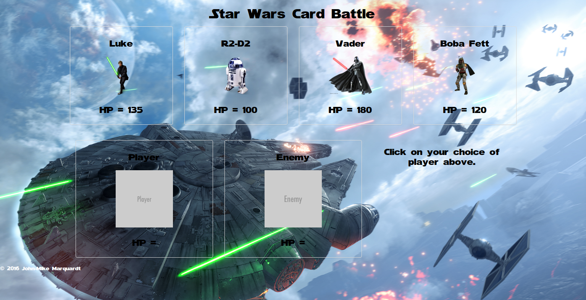

# Star Wars Card Battle Game

## Description
This is the week 4 game assignment for UNC Coding Bootcamp-Star Wars card battle game. The purpose of this exercise was to create a simple game, with sounds and images, where you battle a computer based opponent.  If you choose your enemies in the correct order, you win, as you get stronger and stronger.  If you don't choose wisely, you die!

## Screenshot

## Technologies Used
* HTML
* CSS
* JavaScript
* jQuery

## Future Improvements
* fix the broken reset function
* re-style
* randomize the cards at initialization
* host on firebase for 2-player online play
* characters can win bonus items that help them heal or use force powers

## Author
&copy; 2016 John-Mike Marquardt [Github](https://github.com/codemarq) | [jmmarquardt.com](https://jmmarquardt.com) | [LinkedIn](https://www.linkedin.com/in/jmmarquardt)
